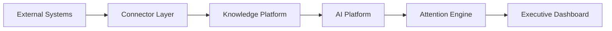
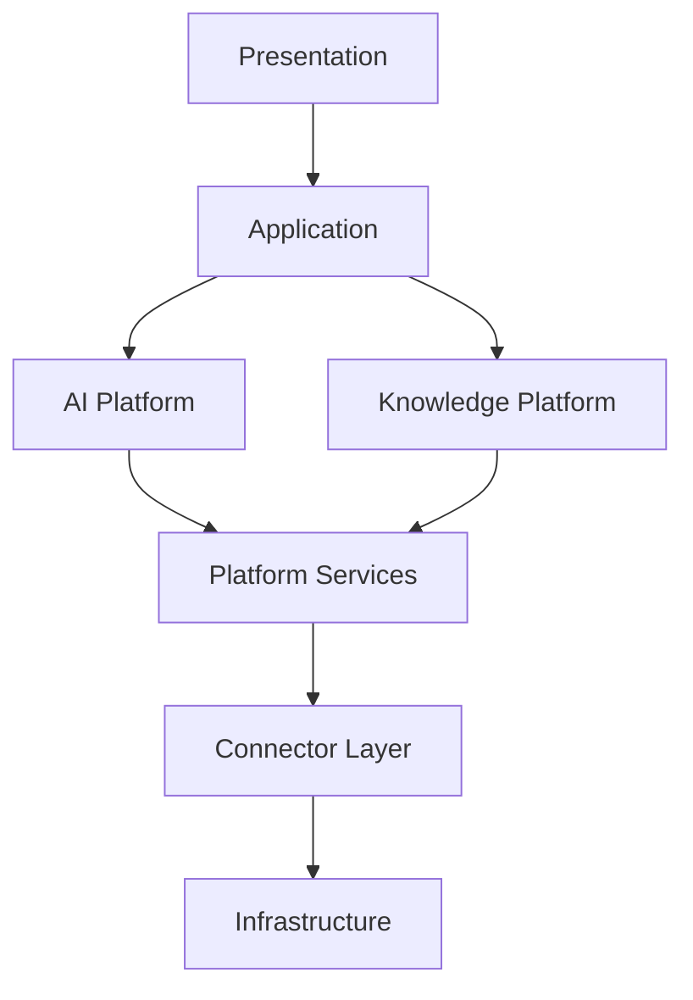
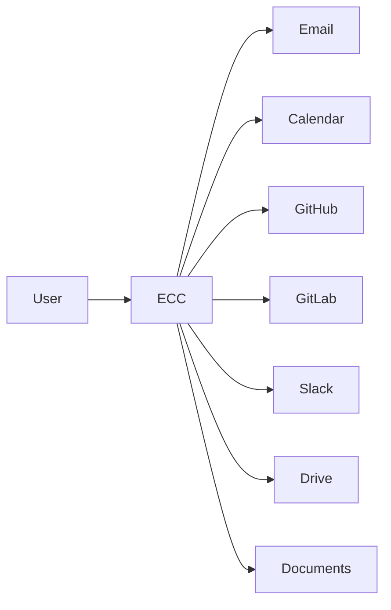
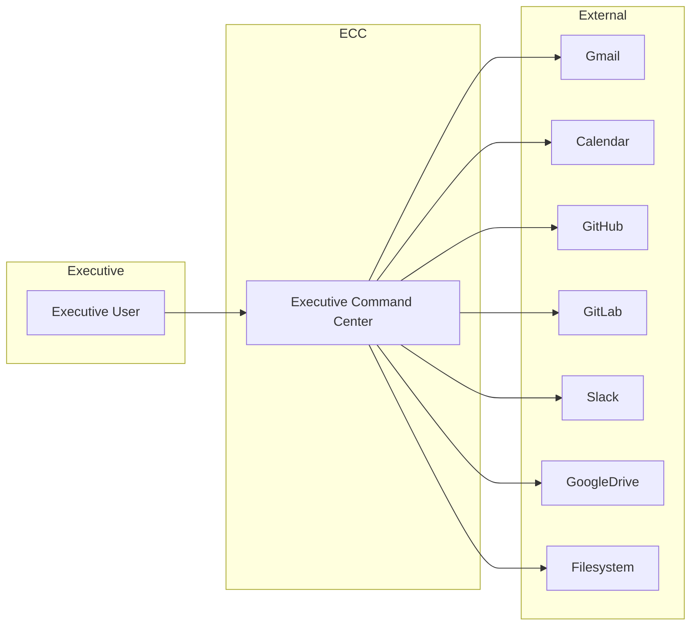
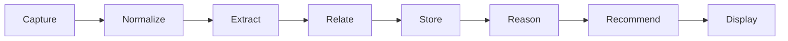

# RFC-004 — System Architecture

# Chapter 1 — Architectural Vision & System Context

---

# Executive Summary

This RFC defines the architecture of Executive Command Center (ECC).

Unlike RFC-001, which defines **what** ECC is, this RFC defines **how** ECC is built.

This document serves four purposes.

1. Establish architectural boundaries.
2. Define subsystem ownership.
3. Define communication patterns.
4. Ensure the platform can evolve for years without fundamental rewrites.

Implementation details belong in later RFCs.

This document defines architectural intent.

---

# Architectural Goals

ECC architecture exists to satisfy the following goals.

## AG-001

Local-first operation.

The system shall remain fully functional without continuous cloud connectivity.

---

## AG-002

AI-native.

Artificial Intelligence is infrastructure.

Every subsystem should be designed assuming AI participation.

---

## AG-003

Composable.

Every subsystem should evolve independently.

---

## AG-004

Replaceable.

Individual technologies may change.

Architectural contracts should remain stable.

---

## AG-005

Explainable.

Every recommendation must be traceable back to original information.

---

## AG-006

Scalable.

The architecture should support years of accumulated knowledge without redesign.

---

## AG-007

Extensible.

New connectors and AI agents should be added without modifying existing systems.

---

# Architectural Principles

The architecture follows several permanent principles.

---

## AP-001

Single Responsibility

Every service owns one capability.

Examples

Planner

Knowledge Graph

Memory

Model Router

Connector Framework

Notification Engine

Each evolves independently.

---

## AP-002

Contract First

Services communicate through contracts.

Never implementation details.

---

## AP-003

Events Before Calls

When possible,

services publish events rather than invoking each other directly.

Benefits

- loose coupling
- replayability
- observability
- auditability

---

## AP-004

Knowledge Is Central

Everything eventually becomes knowledge.

Emails.

Meetings.

Documents.

GitHub PRs.

Calendar events.

Tasks.

All become connected entities.

---

## AP-005

AI Is Infrastructure

LLMs are not business logic.

Business logic never exists inside prompts.

Prompts consume structured information.

Business rules remain code.

---

## AP-006

Replace Technologies, Preserve Architecture

Neo4j may become another graph database.

Ollama may become another inference engine.

React may become another UI framework.

Architecture should survive these changes.

---

# High-Level System Vision

ECC is an orchestration platform.

Not a monolithic application.

Every subsystem contributes to executive intelligence.



The dashboard never directly consumes external systems.

Everything flows through the architecture.

---

# Architectural Layers

ECC consists of seven logical layers.



Each layer has distinct responsibilities.

---

# Layer 1 — Presentation

Purpose

Provide a calm executive experience.

Responsibilities

- Dashboard
- Widgets
- Search
- Planner UI
- Meeting Preparation
- Executive Timeline

The presentation layer contains no business logic.

---

# Layer 2 — Application

Purpose

Coordinate workflows.

Responsibilities

- Commands
- Queries
- User workflows
- Session orchestration

The application layer coordinates.

It does not reason.

---

# Layer 3 — AI Platform

Purpose

Convert information into intelligence.

Responsibilities

- Model Router
- Agents
- Context Builder
- Prompt Manager
- Reflection Engine
- Evaluation

This layer never owns data.

It reasons over data owned elsewhere.

---

# Layer 4 — Knowledge Platform

Purpose

Become the permanent memory.

Responsibilities

- Knowledge Graph
- Entity Resolution
- Semantic Search
- Timeline
- Memory
- Relationships

This layer owns organizational knowledge.

---

# Layer 5 — Platform Services

Purpose

Shared capabilities.

Responsibilities

- Authentication
- Scheduling
- Notifications
- Event Bus
- Audit
- Search
- Metrics

These services support all higher layers.

---

# Layer 6 — Connector Layer

Purpose

Integrate external systems.

Responsibilities

- Gmail
- Calendar
- GitHub
- GitLab
- Slack
- Drive
- Documents

Connectors normalize information.

They do not perform reasoning.

---

# Layer 7 — Infrastructure

Purpose

Provide execution.

Examples

Docker

PostgreSQL

Neo4j

Redis

Qdrant

Ollama

Filesystem

Operating System

Infrastructure is replaceable.

Contracts are not.

---

# System Context

The Executive Command Center sits between the executive and every operational system.



ECC does not become the source of truth.

It becomes the source of understanding.

---

# C4 Context Diagram



---

# Primary Architectural Domains

The platform consists of ten major domains.

| Domain | Responsibility |
|----------|----------------|
| Executive Dashboard | User Interface |
| Planner | Scheduling & prioritization |
| Human Attention Engine | Priority calculation |
| Executive Brain | Long-term reasoning |
| Knowledge Graph | Relationships |
| Memory Engine | Persistent memory |
| AI Platform | Intelligence |
| Connector Framework | External integrations |
| Platform Services | Shared capabilities |
| Infrastructure | Execution |

Each domain owns its data.

Each domain exposes contracts.

---

# Trust Boundaries

Not every system should be trusted equally.

```text
External Systems
        │
────────┼──────────────
        │
 Connector Layer
        │
────────┼──────────────
        │
 Trusted Internal Services
        │
────────┼──────────────
        │
 AI Platform
        │
────────┼──────────────
        │
 Executive Dashboard
```

Everything arriving from external systems is considered **untrusted** until normalized.

AI-generated content is considered **derived**, not authoritative.

Only original source data is authoritative.

---

# Information Flow

Every piece of information follows the same lifecycle.



No subsystem bypasses this pipeline.

This guarantees consistency.

---

# Architectural Boundaries

Subsystems SHALL NOT:

- access another subsystem's database
- call LLMs directly
- bypass the Event Bus
- perform business logic inside connectors
- perform reasoning inside UI components

Subsystems SHALL:

- communicate through contracts
- emit events
- remain independently testable
- remain independently deployable

---

# Architecture Fitness Functions

The following rules are permanent.

## AFF-ARCH-001

Every external integration MUST enter through the Connector Framework.

---

## AFF-ARCH-002

Every LLM invocation MUST use the Model Router.

---

## AFF-ARCH-003

Every recommendation MUST reference evidence.

---

## AFF-ARCH-004

Business logic SHALL NOT exist inside prompts.

---

## AFF-ARCH-005

Every service SHALL own its own data.

---

## AFF-ARCH-006

No service SHALL directly depend upon another service's storage.

---

## AFF-ARCH-007

All communication SHALL be observable.

---

## AFF-ARCH-008

Every architectural decision SHOULD improve replaceability.

---

# Design Trade-Offs

| Decision | Benefit | Trade-off |
|-----------|---------|-----------|
| Local-first | Privacy, speed, ownership | More complex sync |
| Knowledge Graph | Rich reasoning | Higher implementation complexity |
| Event-driven communication | Loose coupling | Operational complexity |
| AI behind Model Router | Replaceable models | Additional abstraction |
| Connector normalization | Consistent data model | Slight ingestion latency |

---

# Non-Goals

This chapter intentionally does not define:

- Database schema
- Agent implementation
- Prompt engineering
- Memory algorithms
- API contracts
- UI components

These are covered in later chapters.

---

# Summary

This chapter establishes the architectural foundation of Executive Command Center.

Key architectural decisions:

- Layered architecture
- Event-driven communication
- Local-first execution
- AI as infrastructure
- Knowledge-centric platform
- Connector normalization
- Replaceable technology stack
- Explainable intelligence

All subsequent architecture chapters build upon these principles.

---

**End of Chapter 1**

**Next Chapter**

> **Chapter 2 — Core Platform & Service Architecture**

Topics:

- Backend services
- API Gateway
- Event Bus
- Model Router
- Scheduler
- Service ownership
- Internal APIs
- Repository structure
- Deployment topology
