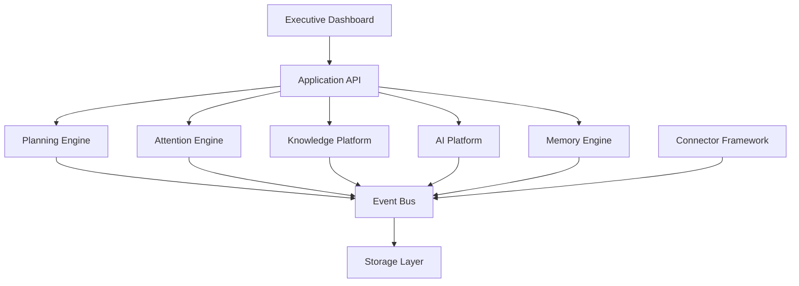
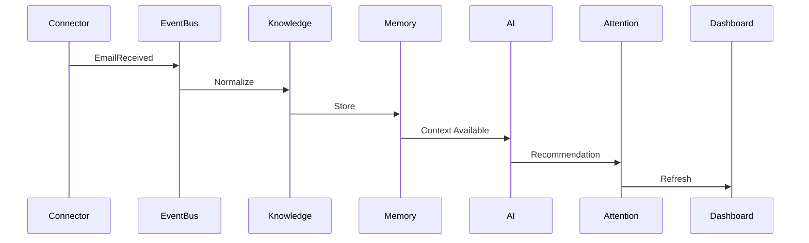
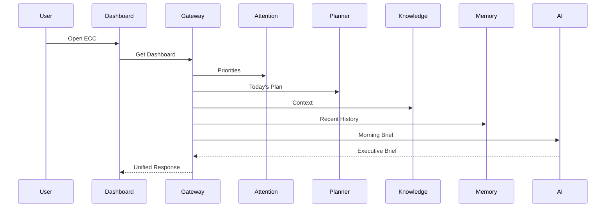

# RFC-004 — Chapter 2A

# Core Platform & Service Architecture

---

# Executive Summary

This chapter defines the runtime architecture of Executive Command Center.

Its purpose is to answer one question:

> **How do all the major platform components collaborate to deliver executive intelligence?**

This chapter intentionally does **not** describe business logic.

Instead it defines:

- service boundaries
- ownership
- communication
- orchestration
- deployment responsibilities

The architecture is intentionally modular.

Every subsystem owns one capability.

Every subsystem is independently testable.

Every subsystem is independently replaceable.

---

# Architectural Goals

The platform architecture is designed to satisfy the following goals.

## GOAL-001

Independent evolution.

Individual services should evolve without impacting unrelated services.

---

## GOAL-002

Replaceability.

Changing one technology should not require changing surrounding services.

---

## GOAL-003

Observability.

Every request.

Every event.

Every AI action.

Every connector.

Must be observable.

---

## GOAL-004

Local execution.

The entire platform should execute on a single developer laptop.

Cloud deployment is optional.

---

## GOAL-005

AI isolation.

Business logic never depends directly upon LLM implementations.

---

# Runtime Architecture



No service communicates directly with storage owned by another service.

---

# Service Decomposition

ECC is intentionally divided into small services.

Large "God Services" are prohibited.

Each service owns exactly one business capability.

---

# Executive Dashboard

## Responsibility

Provide the operational interface for executives.

### Owns

- Dashboard layout
- Widgets
- Search UI
- Meeting preparation UI
- Daily Brief

### Does NOT Own

Business logic.

Scheduling.

Knowledge.

AI.

Authentication.

---

# Application Gateway

The Application Gateway is the only public backend interface.

Every client request enters here.

Responsibilities

- Authentication

- Authorization

- Request routing

- Session management

- Rate limiting

- API aggregation

- Response normalization

The Gateway contains no business rules.

It orchestrates.

---

# Planning Engine

Purpose

Convert executive priorities into executable schedules.

Responsibilities

- Daily planning

- Weekly planning

- Focus block creation

- Calendar optimization

- Time estimation

- Conflict detection

Inputs

Calendar

Tasks

Priorities

Deadlines

Working preferences

Outputs

Suggested schedule

Conflicts

Capacity forecast

Planning recommendations

---

# Attention Engine

Purpose

Continuously calculate executive attention.

Responsibilities

Priority scoring

Risk scoring

Waiting-on tracking

Waiting-for tracking

Urgency

Importance

Dashboard ordering

Interruptions

The Attention Engine owns priority.

No other service calculates priority.

---

# Knowledge Platform

Purpose

Become the permanent semantic understanding of the user's world.

Responsibilities

Knowledge Graph

Relationships

Entities

Search

Timeline

Reasoning context

This service owns knowledge.

Nothing else.

---

# Memory Engine

Purpose

Persist executive memory.

Responsibilities

Working memory

Long-term memory

Semantic memory

Episodic memory

Memory retrieval

Memory indexing

Memory ranking

The Memory Engine stores.

The AI Platform reasons.

---

# AI Platform

Purpose

Generate intelligence.

Responsibilities

Model routing

Agent orchestration

Context building

Prompt execution

Reflection

Evaluation

Tool execution

AI does not own data.

AI consumes data.

---

# Connector Framework

Purpose

Synchronize external systems.

Responsibilities

Polling

Webhooks

Normalization

Authentication

Retries

Rate limiting

Conflict detection

Every connector follows identical lifecycle rules.

---

# Notification Service

Purpose

Deliver information to users.

Responsibilities

Daily Brief

Meeting reminders

Risk alerts

Planning reminders

Notifications

The Notification Service never determines priority.

It receives priority from the Attention Engine.

---

# Event Bus

Purpose

Provide asynchronous communication.

Every important state change becomes an event.

Examples

EmailReceived

↓

MeetingDetected

↓

DecisionRecorded

↓

TaskCreated

↓

KnowledgeUpdated

↓

RecommendationGenerated

No service should depend upon another service's implementation.

Only contracts.

---

# Event Types

Events fall into four categories.

## Capture Events

Generated by connectors.

Examples

EmailReceived

DocumentIndexed

CalendarUpdated

---

## Domain Events

Generated by services.

Examples

CommitmentDetected

RelationshipUpdated

MeetingPrepared

RiskDetected

---

## AI Events

Generated by AI Platform.

RecommendationGenerated

SummaryCreated

TaskExtracted

DecisionExtracted

ReflectionCompleted

---

## System Events

HealthChanged

SyncCompleted

DeploymentCompleted

ModelLoaded

MemoryIndexed

---

# Event Lifecycle



Every major workflow follows this pattern.

---

# Model Router

Every LLM request passes through one component.

```mermaid
flowchart LR

Planner

Knowledge

Memory

Dashboard

↓

Model Router

↓

Ollama

↓

Model
```

Services never reference models directly.

Benefits

Replaceability

Centralized evaluation

Caching

Logging

Fallback

Cost management

Future cloud routing

---

# Scheduler

Purpose

Coordinate all background work.

Responsibilities

Connector sync

Memory indexing

Embedding generation

Daily brief

Meeting preparation

Graph maintenance

Relationship recalculation

Reflection jobs

The Scheduler owns time.

Individual services own execution.

---

# Service Ownership

| Service | Owns | Does Not Own |
|----------|------|--------------|
| Dashboard | UI | Business Logic |
| Gateway | Routing | Domain Logic |
| Planner | Scheduling | Knowledge |
| Attention | Priority | Notifications |
| Knowledge | Relationships | AI |
| Memory | Storage | Planning |
| AI Platform | Intelligence | Data |
| Connectors | Synchronization | Reasoning |
| Notification | Delivery | Prioritization |

No ownership overlaps.

---

# Request Flow



The Dashboard never performs orchestration.

The Gateway orchestrates.

---

# Repository Mapping

Each service maps directly to a backend module.

```
backend/

gateway/

planner/

attention/

knowledge/

memory/

ai/

connectors/

scheduler/

notifications/

shared/
```

No module should own multiple domains.

---

# Architecture Constraints

The following are mandatory.

## ARC-001

Services SHALL NOT access another service's database.

---

## ARC-002

Services SHALL communicate through APIs or Events.

---

## ARC-003

Services SHALL own their data.

---

## ARC-004

Business logic SHALL NOT exist inside connectors.

---

## ARC-005

Business logic SHALL NOT exist inside UI components.

---

## ARC-006

LLMs SHALL only be accessed through Model Router.

---

## ARC-007

Background work SHALL execute through Scheduler.

---

## ARC-008

Every service SHALL expose health endpoints.

---

## ARC-009

Every service SHALL emit structured logs.

---

## ARC-010

Every service SHALL expose metrics.

---

# Failure Isolation

Failures should remain localized.

Examples

```
GitHub Connector Fails

↓

Engineering Dashboard degraded

↓

Everything else continues
```

```
Ollama Offline

↓

AI Recommendations unavailable

↓

Dashboard still usable
```

```
Calendar Sync Failure

↓

Planning degraded

↓

Knowledge remains available
```

No single subsystem should render ECC unusable.

---

# Summary

This chapter establishes the core runtime architecture of Executive Command Center.

Key architectural decisions:

- Modular services
- API Gateway orchestration
- Event-driven communication
- Dedicated Model Router
- Dedicated Scheduler
- Single ownership per domain
- Local-first deployment
- AI separated from business logic
- Failure isolation by design

The next chapter builds on this foundation by defining the internal AI architecture, agent model, planning engine, and orchestration framework.

---

**End of RFC-004 Chapter 2A**

**Next:** Chapter 2B — Internal APIs, Background Workers, Deployment Topology & Failure Modes
