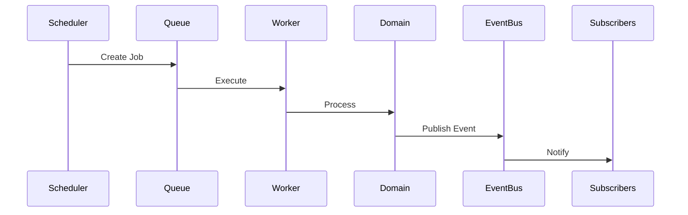

# RFC-004 — Chapter 2B

# Platform Runtime, Deployment & Operational Architecture

---

# Executive Summary

Chapter 2A defined the logical services.

This chapter defines **how those services execute**, **how they communicate**, **how they are deployed**, and **how operational concerns are handled**.

The objective is to ensure ECC remains:

- deployable on a laptop
- scalable to enterprise workloads
- observable
- resilient
- replaceable

without changing application architecture.

---

# Runtime Philosophy

ECC follows four architectural rules.

## RP-001

Domain ownership is permanent.

Infrastructure is temporary.

---

## RP-002

Services communicate through contracts.

Never implementation.

---

## RP-003

State belongs to Domains.

Never to AI.

---

## RP-004

Infrastructure should disappear.

Application developers should think about domains.

Not Docker.

Not Kubernetes.

---

# From Services to Domains

ECC is not organized around technical layers.

It is organized around business capabilities.


Every service belongs to exactly one Domain.

---

# Domain Ownership

## Executive Intelligence

Owns

- Dashboard
- Morning Brief
- Executive Timeline
- Meeting Preparation

Never owns

Storage

Synchronization

AI Models

---

## Knowledge Platform

Owns

- Knowledge Graph

- Search

- Relationships

- Documents

- Timeline

- Decisions

- Memory

---

## Planning

Owns

- Calendar reasoning

- Scheduling

- Focus blocks

- Capacity

- Priorities

---

## Communication

Owns

- Email

- Threads

- Contacts

- Commitments

- Follow-ups

---

## Engineering

Owns

- GitHub

- GitLab

- Jira

- Deployments

- Incidents

---

## Personal OS

Owns

- Health

- Finance

- Goals

- Habits

- Travel

---

## Platform

Owns

Authentication

Metrics

Scheduler

Model Router

Notifications

Audit

Configuration

---

# Internal Communication

ECC uses two communication models.

## Synchronous

```
Dashboard

↓

Gateway

↓

Planner
```

Used only when immediate responses are required.

---

## Asynchronous

```
Connector

↓

Event Bus

↓

Knowledge

↓

Memory

↓

AI

↓

Attention

↓

Dashboard Refresh
```

Default communication model.

---

# Internal API Design

Every service exposes only two interfaces.

```
Commands

Queries
```

Example

Planning

Commands

```
CreateSchedule()

UpdateTask()

BlockCalendar()
```

Queries

```
GetToday()

GetCapacity()

GetFocusTime()
```

Commands modify state.

Queries never modify state.

---

# Repository Structure

```
backend/

domains/

executive/

knowledge/

planning/

communication/

engineering/

personal/

platform/

shared/

contracts/

events/

common/
```

Each domain is independently deployable.

---

# Package Structure

Example

```
planning/

application/

domain/

infrastructure/

contracts/

api/

tests/
```

Every domain follows identical layout.

---

# Background Workers

Background processing is event-driven.

```mermaid
flowchart LR

Scheduler

↓

Worker Queue

↓

Worker

↓

Event

↓

Knowledge
```

Workers never communicate directly.

Everything emits events.

---

# Scheduled Jobs

The Scheduler owns recurring work.

Examples

Every Minute

- Connector polling
- Health checks

Every Five Minutes

- Email sync
- Calendar sync
- GitHub sync

Every Hour

- Graph optimization
- Embedding generation

Every Night

- Reflection
- Relationship recalculation
- Executive journal
- Backup

---

# Job Architecture



Jobs never call downstream services directly.

---

# Deployment Architecture

Minimum deployment.

```mermaid
flowchart TB

Browser

↓

Frontend

↓

Gateway

↓

Backend Domains

↓

Storage

↓

Ollama
```

Everything executes locally.

---

# Production Deployment

```mermaid
flowchart TB

Browser

↓

Load Balancer

↓

Gateway

↓

Domains

↓

Event Bus

↓

Storage Cluster

↓

Model Router

↓

Ollama Cluster
```

Cloud deployment changes infrastructure.

Not architecture.

---

# Storage Ownership

Each Domain owns its persistence.

```
Knowledge

↓

Graph

Planning

↓

Relational

Communication

↓

Relational

Engineering

↓

Relational

Platform

↓

Configuration
```

Cross-domain SQL joins are prohibited.

---

# Configuration

Configuration hierarchy.

```
Environment

↓

Installation

↓

User

↓

Workspace

↓

Runtime
```

Later layers override earlier layers.

Configuration is immutable during execution.

---

# Caching Strategy

Three cache levels.

## UI Cache

Recent dashboard state.

---

## Domain Cache

Frequently accessed entities.

---

## AI Cache

Prompt context.

Embedding cache.

Model cache.

---

Caches are disposable.

Source of truth remains persistent storage.

---

# Health Model

Every domain exposes

```
/health

/ready

/live

/metrics
```

Health is aggregated by Platform Services.

---

# Observability

Every request receives

Correlation ID

Request ID

User ID

Session ID

Trace ID

Every event carries these identifiers.

---

# Logging Standard

Logs are structured.

Required fields.

```
timestamp

service

domain

user

correlation

request

duration

status
```

Never log

Passwords

Tokens

Secrets

Raw prompts containing sensitive data

---

# Metrics

Every domain reports.

Requests

Latency

Errors

Queue depth

Cache hit rate

Memory

CPU

Event throughput

---

# Error Handling

Errors fall into four categories.

## User

Validation.

Permission.

Configuration.

---

## Domain

Business rule failures.

Scheduling conflicts.

Relationship ambiguity.

---

## Platform

Infrastructure.

Storage.

Queue.

Network.

---

## AI

Model unavailable.

Context overflow.

Tool failure.

Hallucination detection.

Each category has independent recovery.

---

# Failure Isolation

No subsystem may cascade failure.

Examples.

```
GitHub Offline

↓

Engineering Domain degraded

↓

Everything else healthy
```

```
Calendar Offline

↓

Planning degraded

↓

Executive Dashboard still loads
```

```
Ollama Offline

↓

Recommendations unavailable

↓

Knowledge still searchable
```

---

# Recovery Strategy

Every component follows.

```
Retry

↓

Fallback

↓

Degraded Mode

↓

Recovery

↓

Replay Events
```

Graceful degradation is preferred over total failure.

---

# Performance Budget

Dashboard

< 500 ms cached

< 2 seconds cold

---

Search

< 500 ms

---

Knowledge Lookup

< 250 ms

---

Morning Brief

< 10 seconds

---

Meeting Preparation

< 15 seconds

---

Connector Sync

< 5 minutes

---

Reflection Jobs

Background only.

---

# Scalability Targets

Initial Design

1 User

---

Target

10 Users

Single machine

---

Future

100 Users

Multi-node

---

Enterprise

1000+ Users

Distributed deployment

Architecture remains unchanged.

---

# Security Boundaries

No external system communicates directly with internal domains.

Everything passes through

Connector

↓

Normalization

↓

Contracts

↓

Events

↓

Domains

AI never receives raw credentials.

---

# Architecture Fitness Functions

## AFF-011

Domains SHALL NOT share databases.

---

## AFF-012

Every domain SHALL own APIs.

---

## AFF-013

Background jobs SHALL be idempotent.

---

## AFF-014

All events SHALL be replayable.

---

## AFF-015

Infrastructure SHALL remain replaceable.

---

## AFF-016

Deployment SHALL support local execution.

---

## AFF-017

Every external dependency SHALL have a degraded mode.

---

## AFF-018

Every service SHALL expose metrics.

---

## AFF-019

Every API SHALL be versioned.

---

## AFF-020

Every domain SHALL be independently testable.

---

# Summary

This chapter establishes the operational architecture of Executive Command Center.

Key decisions.

- Domain-driven ownership
- Event-first communication
- Local-first deployment
- Independent domain storage
- Scheduler-driven background processing
- Structured observability
- Graceful degradation
- Replaceable infrastructure
- Clear deployment topology

The platform is now fully decomposed into independently evolving domains while remaining deployable as a single local application.

---

# Next Chapter

**RFC-004 Chapter 3 — AI Platform Architecture**

Topics.

- Agent Framework
- Multi-Agent Orchestration
- Model Router Internals
- Prompt Execution
- Context Builder
- Reflection Engine
- Tool Calling
- Human Approval
- AI Evaluation
- AI Safety
