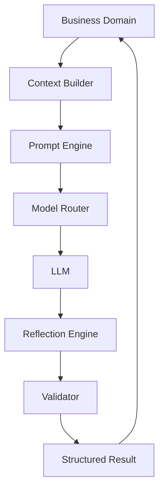

# RFC-004 — Chapter 3

# AI Runtime Architecture

---

# Executive Summary

Artificial Intelligence is the core capability of Executive Command Center.

However, AI is **not** the architecture.

AI is a platform that every business domain consumes.

This distinction is critical.

The Planning domain should never know whether the implementation uses:

- Qwen
- Llama
- DeepSeek
- Claude
- GPT
- Gemini

Likewise, prompts should never contain business rules.

Business rules remain software.

AI performs reasoning.

This chapter defines the AI Runtime that powers ECC.

---

# AI Philosophy

The AI Runtime exists to perform one job:

> Transform structured information into executive intelligence.

The AI Runtime does **not** own:

- data
- business rules
- workflows
- storage

It consumes structured context and produces recommendations.

---

# AI Runtime Goals

The AI Runtime SHALL satisfy the following goals.

## AIR-001

Completely Local First

Every core capability must execute locally using Ollama.

Cloud providers remain optional.

---

## AIR-002

Model Agnostic

Changing LLMs should require zero application changes.

---

## AIR-003

Prompt Agnostic

Business domains never own prompts.

Prompts belong to the runtime.

---

## AIR-004

Deterministic Interfaces

Every AI interaction must have

- input schema

- output schema

- validation

---

## AIR-005

Observable

Every AI execution must be

- logged

- measurable

- replayable

---

# Runtime Overview



No Domain ever communicates directly with a model.

---

# AI Runtime Components

ECC AI Runtime consists of nine major components.

| Component | Responsibility |
|------------|----------------|
| Model Router | Model selection |
| Context Builder | Context assembly |
| Prompt Engine | Prompt generation |
| Tool Runtime | Tool execution |
| Agent Runtime | Agent orchestration |
| Reflection Engine | Self evaluation |
| Validator | Schema validation |
| Evaluation Engine | Quality measurement |
| Memory Retrieval | Context retrieval |

---

# Model Router

The Model Router is the gateway into every LLM.

Responsibilities

- model selection
- retries
- failover
- token budgeting
- streaming
- logging
- metrics

The rest of the application never knows which model executed the request.

---

# Supported Model Types

Different models have different strengths.

ECC routes requests accordingly.

| Task | Preferred Model |
|-------|-----------------|
| Coding | Qwen Coder |
| Planning | Qwen Instruct |
| Reasoning | DeepSeek |
| Summaries | Llama |
| Embeddings | Nomic |

Future models require configuration changes.

Not architecture changes.

---

# Context Builder

LLMs are only as good as their context.

The Context Builder owns context assembly.

Inputs

- Knowledge Graph
- Memory
- Calendar
- Email
- Projects
- People
- Previous Decisions
- User Preferences

Output

```
Structured Context
```

Never

Raw database rows.

---

# Context Composition

Every request follows the same pipeline.

```mermaid
flowchart LR

Question

↓

Intent

↓

Relevant Entities

↓

Memory

↓

Knowledge Graph

↓

Recent Events

↓

Prompt
```

The LLM receives context.

Not databases.

---

# Prompt Engine

Prompt generation is centralized.

Responsibilities

- versioning
- rendering
- templating
- variables
- policies

Prompts are never embedded inside business services.

---

# Prompt Structure

Every prompt contains

System Prompt

↓

Context

↓

Instructions

↓

Expected Schema

↓

Examples (optional)

↓

Safety Policies

This produces deterministic prompts.

---

# Tool Runtime

Agents require tools.

Examples

Search

Calendar

Email

Knowledge

GitHub

Filesystem

The Tool Runtime executes tools.

Agents never call APIs directly.

---

# Tool Contract

Every tool defines

Input Schema

↓

Authorization

↓

Execution

↓

Output Schema

↓

Audit Event

All tools behave identically.

---

# Agent Runtime

Agents are lightweight reasoning units.

Each agent owns one capability.

Examples

Morning Brief Agent

Meeting Preparation Agent

Planning Agent

Task Extraction Agent

Relationship Agent

Reflection Agent

No agent owns multiple unrelated capabilities.

---

# Multi-Agent Architecture

```mermaid
flowchart LR

Planner

Meeting

Memory

Knowledge

↓

Coordinator

↓

Model Router

↓

Results
```

Agents collaborate.

They do not share internal state.

---

# Agent Lifecycle

```mermaid
sequenceDiagram

Coordinator->>Agent

Task

Agent->>Context

Retrieve

Context->>Memory

Load

Memory->>Agent

Context

Agent->>Tools

Execute

Tools->>Agent

Results

Agent->>Model

Reason

Model->>Reflection

Review

Reflection->>Validator

Validate

Validator->>Coordinator

Result
```

Every execution follows this lifecycle.

---

# Reflection Engine

Reflection improves quality.

Instead of accepting the first answer,

the runtime evaluates it.

Questions

Was anything missed?

Were assumptions made?

Does evidence support conclusions?

Can confidence be improved?

Reflection is mandatory for strategic tasks.

Optional for lightweight tasks.

---

# Validator

Every AI response is validated.

Validation includes

JSON Schema

↓

Business Rules

↓

Confidence

↓

Safety

↓

Output

Invalid responses are rejected.

---

# AI Memory Retrieval

Memory retrieval is independent of prompting.

Pipeline

```mermaid
flowchart LR

Intent

↓

Semantic Search

↓

Graph Search

↓

Timeline

↓

Relationships

↓

Context
```

Multiple retrieval strategies execute.

Results are merged.

---

# Evaluation Engine

Every AI execution generates quality signals.

Metrics

Latency

↓

Confidence

↓

User Acceptance

↓

Corrections

↓

Failures

↓

Hallucinations

These metrics continuously improve the runtime.

---

# Human Approval

Certain actions require approval.

Examples

Send Email

Delete Information

Modify Calendar

Delegate Tasks

Run Automation

The AI Runtime cannot bypass approval.

---

# Error Handling

Errors fall into five categories.

Model Failure

Context Failure

Tool Failure

Validation Failure

Reflection Failure

Each category has independent recovery.

---

# Recovery Strategy

```text
Retry

↓

Fallback Model

↓

Reduced Context

↓

Explain Failure

↓

Human Intervention
```

The runtime prefers graceful degradation.

---

# Prompt Versioning

Every prompt is version controlled.

```
Prompt

↓

Version

↓

Tests

↓

Evaluation

↓

Release
```

Prompt changes follow the same review process as code.

---

# Model Selection

Selection is rule-based.

Example

```
Coding

↓

Qwen Coder

Planning

↓

Qwen Instruct

Meeting Prep

↓

DeepSeek

Embeddings

↓

Nomic
```

Business services never select models.

---

# AI Safety

The runtime prevents

Prompt Injection

↓

Unsafe Tool Usage

↓

Unauthorized Actions

↓

Data Leakage

↓

Infinite Loops

↓

Runaway Agents

Safety belongs to the runtime.

Not individual agents.

---

# Runtime Constraints

## ARC-AI-001

Domains SHALL NOT call LLMs directly.

---

## ARC-AI-002

Prompts SHALL NOT contain business logic.

---

## ARC-AI-003

Every response SHALL be validated.

---

## ARC-AI-004

Every execution SHALL be logged.

---

## ARC-AI-005

Every recommendation SHALL reference evidence.

---

## ARC-AI-006

Agents SHALL own exactly one capability.

---

## ARC-AI-007

Tool execution SHALL be auditable.

---

## ARC-AI-008

Models SHALL remain replaceable.

---

# Architecture Fitness Functions

AFF-AI-001

No direct Ollama calls outside Model Router.

---

AFF-AI-002

No raw prompts inside business domains.

---

AFF-AI-003

All prompts version controlled.

---

AFF-AI-004

Every tool schema validated.

---

AFF-AI-005

Every AI response traceable.

---

AFF-AI-006

Every agent independently testable.

---

AFF-AI-007

Reflection mandatory for strategic workflows.

---

AFF-AI-008

AI failures shall never crash business domains.

---

# Summary

The AI Runtime is a platform consumed by every business domain.

It provides

- model routing
- context building
- prompt execution
- agent orchestration
- reflection
- validation
- evaluation
- safety
- memory retrieval

Business domains remain completely isolated from AI implementation details.

Changing from Ollama to another inference engine should require changes only inside the AI Runtime.

This architectural separation ensures long-term maintainability while allowing AI capabilities to evolve independently of the rest of the system.

---

# Next Chapter

**RFC-004 Chapter 4 — Knowledge Platform & Memory Architecture**

Topics

- Personal Knowledge Graph
- Entity Resolution
- Episodic Memory
- Semantic Memory
- Working Memory
- Timeline
- Graph Search
- Hybrid Retrieval
- Knowledge Evolution
- Memory Consolidation
