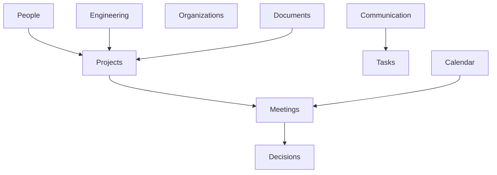

# RFC-004 — Chapter 4

# Knowledge Platform & Memory Architecture

---

# Executive Summary

The Knowledge Platform is the heart of Executive Command Center.

AI models will change.

Connectors will change.

Databases will change.

The Knowledge Platform is intended to survive all of those changes.

ECC is fundamentally **a memory system**.

The dashboard, planners, recommendations and AI agents exist because of the quality of the underlying memory.

This chapter defines how ECC remembers.

---

# Philosophy

Traditional software stores records.

ECC stores understanding.

Instead of asking

> "Where is this document?"

ECC answers

> "What do we know about Project Atlas?"

Those are fundamentally different problems.

---

# Core Principles

## KP-001

Everything becomes knowledge.

Emails.

Meetings.

Slack messages.

GitHub PRs.

Architecture Decisions.

Calendar Events.

Tasks.

Documents.

Everything eventually becomes part of the Knowledge Graph.

---

## KP-002

Knowledge never exists in isolation.

Every entity must be connected.

Documents connect to:

- Projects
- Meetings
- People
- Decisions
- Tasks

Nothing floats independently.

---

## KP-003

Memory is cumulative.

Knowledge is never overwritten.

It evolves.

Historical context remains available forever.

---

# Knowledge Pipeline

```mermaid
flowchart LR

Capture

↓

Normalize

↓

Extract

↓

Resolve

↓

Relate

↓

Store

↓

Index

↓

Reason

↓

Recommend
```

Every connector follows this pipeline.

---

# Knowledge Domains

The graph consists of bounded domains.



Every domain owns its entities.

Relationships connect domains.

---

# Entity Model

Everything in ECC is represented as an Entity.

Every entity has:

```yaml
id:
type:
created_at:
updated_at:
confidence:
source:
visibility:
relationships:
timeline:
metadata:
```

Every entity is immutable.

Updates create new versions.

---

# Primary Entity Types

## Person

Examples

- Employee
- Manager
- Recruiter
- Customer
- Vendor

Relationships

Works On

Reports To

Attended

Owns

Mentioned In

Waiting On

---

## Project

Relationships

Contains

Depends On

Owned By

Blocked By

Related To

---

## Meeting

Relationships

Participants

Agenda

Decisions

Action Items

Recording

Transcript

Follow Ups

---

## Decision

Stores

Context

Alternatives

Reason

Owner

Outcome

Review Date

This becomes one of the most valuable entity types.

---

## Task

Relationships

Assigned To

Created From

Depends On

Blocks

Completed By

---

## Document

Relationships

References

Mentioned By

Version Of

Discussed In

---

# Relationship Model

Relationships are first-class citizens.

Example

```
Lucky

↓

Owns

↓

Project Atlas

↓

Contains

↓

Architecture RFC

↓

Discussed In

↓

Architecture Meeting

↓

Generated

↓

Decision
```

Reasoning happens over relationships.

Not documents.

---

# Relationship Types

Examples

Works With

Reports To

Created

Reviewed

Assigned

Blocked

Depends On

Mentioned

Referenced

Attended

Approved

Rejected

Scheduled

Delayed

Relationships are versioned.

---

# Temporal Model

Knowledge evolves over time.

Every entity contains

```yaml
valid_from:
valid_until:
observed_at:
confidence:
```

This allows ECC to answer

"What did we believe last month?"

instead of only

"What do we believe today?"

---

# Memory Architecture

ECC models four kinds of memory.

```mermaid
flowchart TB

Working

↓

Short Term

↓

Long Term

↓

Semantic
```

Each layer has different responsibilities.

---

# Working Memory

Purpose

Current conversation.

Current task.

Current reasoning.

Lifetime

Minutes.

Stored

In memory only.

---

# Short-Term Memory

Purpose

Today's work.

Open meetings.

Recent emails.

Current planning.

Lifetime

Hours to days.

Optimized for speed.

---

# Long-Term Memory

Purpose

Permanent historical record.

Contains

Projects

Meetings

Architecture

Hiring

Engineering

Learning

Relationships

Never expires.

---

# Semantic Memory

Purpose

Conceptual understanding.

Example

ECC knows

Project Atlas

is

an engineering initiative

owned by

Lucky

using

Neo4j

This understanding exists independently of individual emails.

---

# Episodic Memory

Stores experiences.

Examples

Architecture Review

Quarterly Planning

Production Incident

Hiring Interview

Each event contains

Participants

Timeline

Documents

Decisions

Lessons

---

# Memory Consolidation

New information is never immediately promoted.

Pipeline

```
Working

↓

Verification

↓

Relationship Resolution

↓

Consolidation

↓

Long-Term Memory
```

This prevents noisy information entering permanent memory.

---

# Knowledge Graph

The graph stores

Entities

Relationships

Time

Evidence

Confidence

Every edge has metadata.

Example

```
Lucky

↓

Reports To

↓

CTO

Confidence: 0.97

Evidence:

Slack

Email

HR Document
```

---

# Confidence Model

Every fact carries confidence.

Sources increase confidence.

Contradictions decrease confidence.

Example

Email

0.6

Calendar

0.8

Meeting Transcript

0.9

Manual Confirmation

1.0

Reasoning always prefers higher confidence.

---

# Entity Resolution

Information rarely arrives cleanly.

Example

"Lucky"

"Neet"

"L Jain"

"lucky.jain"

may all refer to the same person.

Entity Resolution determines identity.

Pipeline

```
Normalize

↓

Similarity

↓

Evidence

↓

Merge

↓

Review (if needed)
```

---

# Knowledge Evolution

Knowledge changes.

Entities are versioned.

```
Project Atlas

v1

↓

v2

↓

v3
```

Previous versions remain searchable.

---

# Retrieval Architecture

ECC uses hybrid retrieval.

```mermaid
flowchart LR

Query

↓

Keyword Search

↓

Semantic Search

↓

Graph Traversal

↓

Timeline Search

↓

Ranking

↓

Context
```

No single retrieval strategy is sufficient.

---

# Context Window Builder

The Knowledge Platform never sends entire documents.

It constructs context.

Context contains

Relevant People

Relevant Projects

Recent Decisions

Historical Events

Open Risks

Related Documents

Pending Tasks

The LLM receives understanding.

Not files.

---

# Graph Traversal

Example

Question

"What risks exist for Atlas?"

Traversal

Project

↓

Tasks

↓

Blocked Items

↓

Recent Decisions

↓

Incidents

↓

PRs

↓

Meeting Notes

↓

Summary

Reasoning happens over connected knowledge.

---

# Search Strategy

ECC supports four search modes.

## Keyword

Fast.

Exact.

---

## Semantic

Conceptual similarity.

---

## Graph

Relationship traversal.

---

## Temporal

Historical reasoning.

All four execute together.

---

# Knowledge Freshness

Every entity has freshness.

Fresh

↓

Aging

↓

Stale

↓

Archived

Staleness influences recommendations.

Never deletion.

---

# Source Attribution

Every recommendation must answer

Why?

By referencing

Email

Meeting

Slack

GitHub

Calendar

Document

Manual Note

No recommendation exists without evidence.

---

# Data Ownership

The Knowledge Platform owns

- Entity Graph
- Relationships
- Timeline
- Search
- Resolution
- Versioning

It does not own

Planning

AI

UI

Notifications

Scheduling

---

# Performance Goals

Entity Lookup

<100ms

---

Graph Traversal

<250ms

---

Hybrid Search

<500ms

---

Context Build

<1 second

---

Knowledge Consolidation

Background only

---

# Failure Modes

If Graph Database fails

↓

Keyword Search remains available

If Embeddings fail

↓

Graph traversal continues

If Entity Resolution fails

↓

Entities remain separate

Never lose information.

Prefer duplicate knowledge over incorrect merging.

---

# Architecture Constraints

## ARC-KG-001

Every entity SHALL have provenance.

---

## ARC-KG-002

Every relationship SHALL be versioned.

---

## ARC-KG-003

Knowledge SHALL be append-only.

---

## ARC-KG-004

No entity SHALL exist without a type.

---

## ARC-KG-005

Every recommendation SHALL reference graph evidence.

---

## ARC-KG-006

Knowledge deletion SHALL require explicit user action.

---

## ARC-KG-007

Historical state SHALL remain queryable.

---

# Architecture Fitness Functions

AFF-KG-001

Entity resolution precision >95%

---

AFF-KG-002

Relationship integrity continuously validated.

---

AFF-KG-003

Every entity reachable from graph root.

---

AFF-KG-004

No orphaned entities.

---

AFF-KG-005

Hybrid search latency <500ms.

---

AFF-KG-006

Knowledge graph rebuildable from raw events.

---

# Summary

The Knowledge Platform is the permanent memory of Executive Command Center.

It provides:

- Knowledge Graph
- Hybrid Search
- Entity Resolution
- Temporal Reasoning
- Relationship Intelligence
- Episodic Memory
- Semantic Memory
- Context Construction
- Historical Traceability
- Explainable Evidence

Every intelligent capability in ECC depends upon this platform.

Without a high-quality knowledge layer, the AI Runtime becomes a generic chatbot.

With it, ECC becomes an Executive Operating System capable of reasoning over years of accumulated organizational knowledge.

---

# Next Chapter

**RFC-004 Chapter 5 — Human Attention Engine**

Topics:

- Cognitive Load Model
- Executive Priority Engine
- Waiting On / Waiting For
- Risk Engine
- Focus Engine
- Notification Intelligence
- Daily Brief Generation
- Executive Command Center Dashboard
- Self-Evaluation Loop
