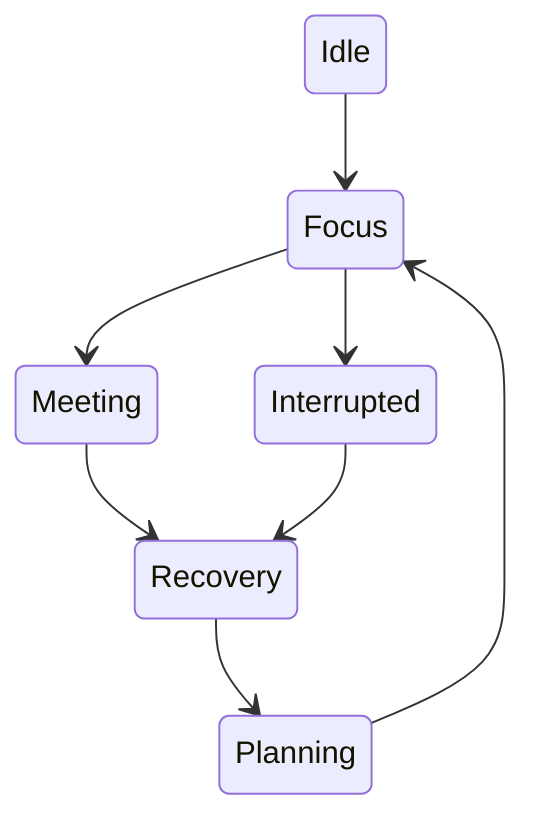
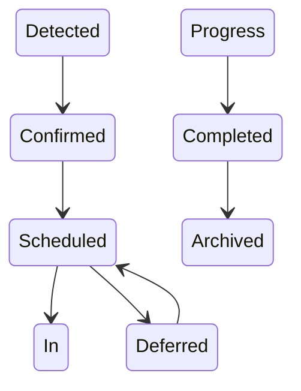

# RFC-004 — Chapter 5

# Human Attention Engine

---

# Executive Summary

The Human Attention Engine (HAE) is the defining capability of Executive Command Center.

Every productivity application stores information.

Some applications help users organize information.

Very few systems attempt to manage **human attention**.

ECC is designed around a different premise.

> **The scarce resource is not information. It is executive attention.**

The Human Attention Engine continuously determines:

- what deserves attention
- what should wait
- what can be ignored
- what requires escalation
- what should disappear

Everything presented to the executive originates from this engine.

---

# Why This Exists

Modern executives receive:

- Hundreds of emails
- Slack messages
- Calendar invites
- Pull Requests
- Incident alerts
- Documents
- Dashboards
- Notifications

Every system believes its information is important.

The executive experiences

noise.

The Human Attention Engine exists to transform

```
Information

↓

Understanding

↓

Prioritization

↓

Attention

↓

Action
```

---

# Design Goals

## HAE-001

Protect executive focus.

---

## HAE-002

Reduce context switching.

---

## HAE-003

Surface risks before they become incidents.

---

## HAE-004

Prevent forgotten commitments.

---

## HAE-005

Minimize interruptions.

---

## HAE-006

Learn executive preferences over time.

---

# Core Architecture

```mermaid
flowchart TB

Knowledge

Memory

Calendar

Communication

Engineering

↓

Attention Engine

↓

Priority Engine

↓

Risk Engine

↓

Focus Engine

↓

Executive Dashboard
```

No connector directly generates dashboard widgets.

Everything passes through the Attention Engine.

---

# Attention Pipeline

Every piece of incoming information follows the same pipeline.

```mermaid
flowchart LR

Capture

↓

Classify

↓

Understand

↓

Score

↓

Prioritize

↓

Schedule

↓

Present

↓

Learn
```

---

# Cognitive Load Model

The engine estimates cognitive load continuously.

Load is calculated from multiple dimensions.

| Dimension | Example |
|------------|----------|
| Meetings | Hours scheduled |
| Open Commitments | Tasks awaiting action |
| Waiting Items | External dependencies |
| Context Switching | Number of active projects |
| Engineering Risk | Incidents, blocked releases |
| Personal Load | Travel, health, family |
| Historical Patterns | User workload history |

The system optimizes for sustainable attention.

Not maximum utilization.

---

# Executive State Model

At any point an executive exists in one state.



The dashboard adapts based on the current state.

---

# Priority Engine

The Priority Engine is the heart of HAE.

Every entity receives a continuously calculated Priority Score.

The score is recalculated whenever:

- new email arrives
- meeting changes
- task created
- decision recorded
- incident occurs
- deadline approaches
- user behavior changes

---

# Priority Formula

Priority is **not** a simple weighted score.

It is composed from independent signals.

```text
Priority =
Urgency
+
Importance
+
Strategic Value
+
Relationship Impact
+
Executive Responsibility
+
Risk
-
Current Cognitive Load
-
Existing Commitments
```

Each signal is independently explainable.

---

# Priority Signals

## Urgency

Time sensitivity.

Examples

Production outage.

Today's interview.

Expiring deadline.

---

## Importance

Business value.

Examples

Quarter planning.

Hiring decision.

Architecture review.

---

## Strategic Value

Long-term organizational impact.

Example

Hiring roadmap.

Migration.

Budget planning.

---

## Relationship Impact

Who is affected?

CEO

↓

Direct Report

↓

Customer

↓

Vendor

↓

Internal Discussion

Relationships influence priority.

---

## Risk

Probability × Impact.

Engineering

Financial

Organizational

Reputational

Personal

---

## Opportunity

Not everything important is urgent.

Opportunity scoring surfaces

learning

mentorship

strategic work

innovation

before they disappear.

---

# Executive Priority Levels

The engine classifies every item.

| Level | Description |
|--------|-------------|
| P0 | Immediate attention |
| P1 | Today |
| P2 | This week |
| P3 | Background |
| P4 | Archive |

Only P0 and P1 appear automatically.

---

# Waiting Engine

Executives frequently forget

what they are waiting for.

ECC maintains two independent queues.

## Waiting On

Work blocked by others.

Example

Vendor response.

Candidate feedback.

PR review.

---

## Waiting For

Others waiting on the executive.

Example

Approval.

Decision.

Reply.

Feedback.

These queues become first-class dashboard widgets.

---

# Commitment Engine

Every commitment is tracked.

Sources

Email

↓

Meeting

↓

Slack

↓

Voice Notes

↓

Manual Tasks

↓

GitHub

The executive never manually records commitments unless desired.

---

# Commitment Lifecycle



No commitment disappears.

---

# Risk Engine

The Risk Engine continuously evaluates risk.

Risk Categories

Engineering

Operational

Personal

Financial

Delivery

Hiring

Communication

Knowledge

Each category has independent scoring.

---

# Risk Lifecycle

```mermaid
flowchart LR

Detected

↓

Verified

↓

Scored

↓

Assigned

↓

Tracked

↓

Resolved
```

Every risk has an owner.

---

# Focus Engine

Focus time is treated as a scarce resource.

The Focus Engine protects uninterrupted work.

Inputs

Calendar

Priority

Interruptions

Historical Patterns

Energy Profile

Meeting Density

Outputs

Focus Blocks

Break Suggestions

Task Sequencing

Meeting Recommendations

---

# Interruptions

Not every interruption deserves attention.

Interruptions are classified.

Immediate

Today

This Week

Ignore

Interruptions may be delayed.

Never silently discarded.

---

# Daily Brief Generator

Every morning ECC generates an Executive Brief.

Sections

Today's Priorities

Meeting Preparation

Risks

Waiting On

Waiting For

Follow-ups

Engineering Health

Personal Reminders

Recommended Schedule

Estimated Reading Time

<5 minutes.

---

# Meeting Preparation

Generated automatically.

Contents

Participants

Relationship Summary

Previous Meetings

Open Questions

Relevant Documents

Recent Emails

Open Tasks

Recent Decisions

Potential Risks

Suggested Questions

Meeting preparation becomes one click.

---

# End-of-Day Reflection

The engine automatically prepares

Completed Work

Open Commitments

New Knowledge

Missed Opportunities

Tomorrow's Priorities

Reflection Notes

The executive never starts tomorrow from zero.

---

# Executive Dashboard

The dashboard becomes a projection of the Attention Engine.

```mermaid
flowchart TD

Morning Brief

Priority Queue

Waiting On

Waiting For

Meetings

Risks

Recommendations

Timeline

Insights
```

No widget exists without attention value.

---

# Learning Loop

The engine continuously learns.

Signals

Dismissed recommendations.

Accepted recommendations.

Completed tasks.

Deferred work.

Ignored notifications.

Manual corrections.

Learning adjusts

priority

timing

recommendations

not business rules.

---

# Explainability

Every recommendation must answer

Why?

Example

> Schedule Architecture Review today.

Evidence

- PR blocked for 5 days
- CTO attending
- Sprint deadline Friday
- Three dependent teams

Confidence

93%

No recommendation exists without explanation.

---

# Failure Modes

## Too Many Recommendations

Mitigation

Top-N ranking.

---

## Incorrect Priorities

Mitigation

User feedback.

Continuous learning.

---

## Recommendation Fatigue

Mitigation

Recommendation budget.

Maximum recommendations per day.

---

## Notification Spam

Mitigation

Batching.

Focus mode.

Priority filtering.

---

# Performance Targets

Priority recalculation

<100 ms

---

Dashboard refresh

<500 ms

---

Morning Brief

<10 seconds

---

Meeting preparation

<15 seconds

---

Recommendation generation

<3 seconds

---

# Architecture Constraints

## ARC-HAE-001

No dashboard widget bypasses the Attention Engine.

---

## ARC-HAE-002

Every recommendation requires evidence.

---

## ARC-HAE-003

Priority must be explainable.

---

## ARC-HAE-004

Every commitment has a lifecycle.

---

## ARC-HAE-005

No notification without priority.

---

## ARC-HAE-006

The engine shall optimize for cognitive load, not task count.

---

# Architecture Fitness Functions

AFF-HAE-001

Forgotten commitments trend toward zero.

---

AFF-HAE-002

Recommendation acceptance improves over time.

---

AFF-HAE-003

Priority changes are explainable.

---

AFF-HAE-004

Dashboard contains only actionable information.

---

AFF-HAE-005

Attention score recalculates incrementally.

---

AFF-HAE-006

Every recommendation links to evidence.

---

# Future Evolution

The Human Attention Engine will evolve into the executive's cognitive operating layer.

Future capabilities include

- energy-aware scheduling
- decision fatigue prediction
- proactive delegation
- organizational bottleneck detection
- executive burnout detection
- strategic opportunity identification
- meeting elimination recommendations
- quarterly attention analytics

---

# Summary

The Human Attention Engine is the core differentiator of Executive Command Center.

It transforms:

- information into priorities
- commitments into schedules
- risks into actions
- notifications into meaningful interruptions
- knowledge into executive focus

Unlike traditional task managers, the Human Attention Engine does not optimize for completing more work.

It optimizes for ensuring the executive spends attention on the **highest-value work at the right time**, while preserving cognitive capacity for strategic decision-making.

This engine becomes the central nervous system of the entire platform.

---

# Next Chapter

**RFC-004 Chapter 6 — Connector Framework & Integration Platform**

Topics

- Connector SDK
- Gmail
- Google Calendar
- GitHub
- GitLab
- Slack
- Google Drive
- Local Files
- MCP Integration
- Synchronization Engine
- Conflict Resolution
- Incremental Sync
- Webhooks
- Event Normalization
