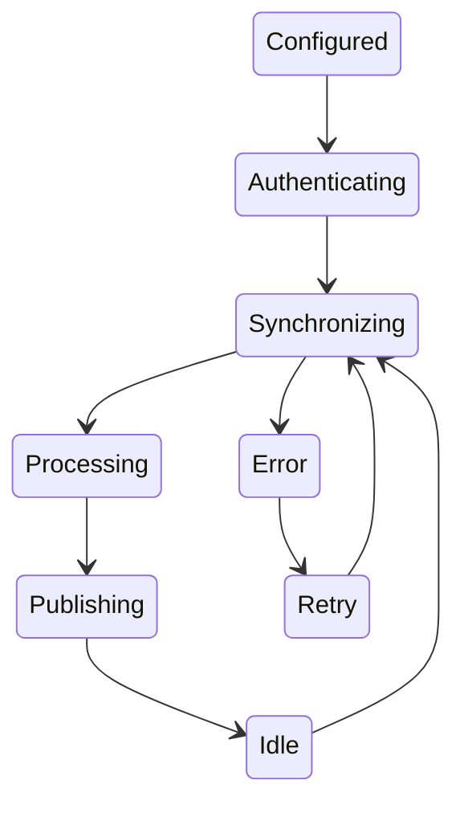

# RFC-004 — Chapter 6

# Connector Framework & Integration Platform

---

# Executive Summary

The Connector Framework is the ingress layer of Executive Command Center.

Its responsibility is **not** to expose external APIs.

Its responsibility is to transform fragmented information from dozens of external systems into a **single normalized event model** consumed by the Knowledge Platform.

Connectors should never contain business logic.

Connectors should never contain AI.

Connectors only:

- authenticate
- synchronize
- normalize
- publish events

Everything else belongs elsewhere.

---

# Philosophy

External systems are systems of record.

ECC is the system of understanding.

Example

```
GitHub owns Pull Requests

ECC owns

• Why the PR matters

• Which project it belongs to

• Which meeting discussed it

• Which executive should care
```

---

# Architectural Goals

## CFG-001

Every integration follows identical lifecycle.

---

## CFG-002

Every connector publishes the same event model.

---

## CFG-003

Every connector supports incremental synchronization.

---

## CFG-004

Every connector is independently deployable.

---

## CFG-005

Adding a connector should require zero changes to existing connectors.

---

# Connector Architecture

```mermaid
flowchart TB

External

↓

Connector

↓

Normalizer

↓

Identity Resolution

↓

Event Publisher

↓

Knowledge Platform

↓

AI Runtime

↓

Attention Engine
```

Every connector terminates at the Event Bus.

---

# Connector Responsibilities

A connector owns only

- OAuth
- Authentication
- API communication
- Rate limiting
- Retry
- Pagination
- Delta Sync
- Webhooks
- Event publication

Nothing else.

---

# Connector Lifecycle



---

# Connector SDK

Every connector implements the same interface.

```typescript
interface Connector {

 connect()

 disconnect()

 sync()

 webhook()

 health()

 capabilities()

}
```

This guarantees consistency.

---

# Connector Manifest

Every connector declares metadata.

```yaml
name:

version:

permissions:

rate_limits:

supported_events:

webhook:

incremental_sync:

oauth:

health_endpoint:
```

---

# Synchronization Model

ECC supports three synchronization strategies.

---

## Polling

Used when APIs provide no events.

Examples

Legacy APIs.

---

## Webhooks

Preferred.

Near real-time.

---

## Delta Synchronization

Uses timestamps,

revision IDs,

change tokens,

or cursors.

Preferred for large datasets.

---

# Event Model

All connectors publish identical event envelopes.

```yaml
event_id:

connector:

entity_type:

entity_id:

operation:

timestamp:

actor:

source:

payload:

metadata:

correlation_id:
```

No connector publishes vendor-specific objects.

---

# Normalization

Every external system has different terminology.

Examples

GitHub

Issue

GitLab

Issue

Jira

Ticket

ECC

Work Item

Normalization creates a unified language.

---

# Supported Connector Types

## Communication

- Gmail
- Outlook
- Slack
- Teams

---

## Planning

- Google Calendar
- Microsoft Calendar

---

## Engineering

- GitHub
- GitLab
- Jira
- Linear

---

## Documents

- Google Drive
- Notion
- Confluence
- Local Files

---

## Storage

- Dropbox

- OneDrive

Future

---

## Personal

Health

Finance

Travel

Future.

---

# Gmail Connector

Responsibilities

- Email synchronization

- Thread detection

- Attachment indexing

- Label synchronization

- Incremental history sync

Events

EmailReceived

EmailUpdated

ThreadUpdated

AttachmentAdded

---

# Calendar Connector

Responsibilities

Calendar Events

Participants

Recurring Events

Meeting Changes

Cancellation

Events

MeetingCreated

MeetingUpdated

MeetingCancelled

---

# GitHub Connector

Responsibilities

Repositories

PRs

Issues

Reviews

Commits

Releases

Events

PRCreated

PRMerged

IssueOpened

ReviewRequested

WorkflowFailed

DeploymentCreated

---

# GitLab Connector

Responsibilities

Merge Requests

Pipelines

Issues

Deployments

Approvals

Events

MergeRequestCreated

PipelineFailed

ApprovalRequested

---

# Slack Connector

Responsibilities

Channels

Threads

Messages

Reactions

Mentions

Events

MessageCreated

ThreadUpdated

MentionDetected

ReactionAdded

---

# Google Drive Connector

Responsibilities

Documents

Folders

Permissions

Version Changes

Events

DocumentCreated

DocumentUpdated

PermissionChanged

---

# Local Files Connector

Purpose

Monitor

Markdown

PDF

Word

Text

CSV

Folders

Changes

Uses filesystem watching.

No polling.

---

# MCP Connector

Purpose

Integrate external tools using the Model Context Protocol.

Examples

Cursor

Claude Desktop

Future AI tools

MCP tools appear as first-class ECC tools.

---

# Identity Resolution

Connectors never resolve identities.

They emit observations.

Identity Resolution belongs to the Knowledge Platform.

Example

```
Lucky Jain

Lucky

lucky.jain

LUCKY

↓

Person
```

---

# Conflict Resolution

Different systems may disagree.

Example

Calendar

Meeting 2 PM

Email

Meeting 3 PM

ECC stores both observations.

Resolution belongs to Knowledge Platform.

Never Connector.

---

# Retry Policy

Failures use exponential backoff.

```
1 sec

↓

5 sec

↓

30 sec

↓

5 min

↓

30 min
```

Permanent failures require user intervention.

---

# Rate Limiting

Every connector owns its own rate policy.

Never global.

Connector SDK exposes

```
remaining

reset

quota
```

The Scheduler uses these values.

---

# Security Model

Secrets never leave Platform Services.

Connectors receive temporary credentials.

Tokens are encrypted at rest.

Refresh is automatic.

---

# Connector Health

Every connector exposes

```
Connected

↓

Healthy

↓

Last Sync

↓

Latency

↓

Errors

↓

Backlog
```

Dashboard aggregates health.

---

# Incremental Synchronization

Full synchronization is expensive.

Every connector should support

```
Checkpoint

↓

Changes

↓

Apply

↓

Checkpoint
```

Only changed data moves.

---

# Backfill

Large historical imports execute separately.

```
Recent Sync

↓

Historical Import

↓

Relationship Resolution

↓

Indexing
```

Backfill never blocks daily usage.

---

# Event Ordering

Ordering guarantees.

Within one connector

Ordered.

Across connectors

Eventually consistent.

Knowledge Platform resolves timing.

---

# Attachment Processing

Attachments enter independent pipeline.

```
Document

↓

OCR

↓

Parsing

↓

Chunking

↓

Embeddings

↓

Knowledge Platform
```

Large documents never block connector execution.

---

# Connector Sandbox

Connectors cannot

- Call LLMs
- Query Knowledge Graph
- Schedule Tasks
- Generate Recommendations
- Modify Dashboard

They publish observations only.

---

# Observability

Metrics

- Sync duration
- Sync latency
- Events published
- Errors
- Retry count
- API quota
- Webhook latency

Every connector exposes metrics.

---

# Performance Targets

Webhook processing

<2 seconds

---

Incremental sync

<60 seconds

---

Cold sync

Background

---

Health check

<100 ms

---

# Failure Modes

## Gmail Offline

Email sync delayed.

Existing knowledge remains available.

---

## GitHub Rate Limited

Scheduler reduces polling frequency.

---

## Calendar Authentication Failure

Planning degraded.

Dashboard remains functional.

---

## Slack Webhook Failure

Automatic fallback to incremental polling.

---

# Architecture Constraints

## ARC-CON-001

Connectors SHALL contain no business logic.

---

## ARC-CON-002

Connectors SHALL never call LLMs.

---

## ARC-CON-003

Connectors SHALL publish normalized events only.

---

## ARC-CON-004

Every connector SHALL support health monitoring.

---

## ARC-CON-005

Identity resolution SHALL occur outside connectors.

---

## ARC-CON-006

Secrets SHALL remain within Platform Services.

---

# Architecture Fitness Functions

AFF-CON-001

Adding a connector requires no changes to existing connectors.

---

AFF-CON-002

Connector failures do not impact unrelated connectors.

---

AFF-CON-003

All events are replayable.

---

AFF-CON-004

Incremental sync is the default.

---

AFF-CON-005

Connectors remain stateless where practical.

---

AFF-CON-006

Event publication is idempotent.

---

# Future Connectors

Planned integrations.

Communication

- WhatsApp
- Signal

Engineering

- Azure DevOps
- Bitbucket

Product

- Productboard
- Aha

CRM

- Salesforce
- HubSpot

Finance

- Tally
- QuickBooks

Personal

- Garmin
- Apple Health
- Google Fit

AI

- OpenAI
- Anthropic
- Gemini

Enterprise

- SAP
- Workday

Adding these should require only a new connector package.

No architectural changes.

---

# Summary

The Connector Framework provides a standardized integration layer between Executive Command Center and external systems.

Key architectural decisions:

- Connector SDK
- Normalized event model
- Event-driven integration
- Incremental synchronization
- Identity resolution outside connectors
- Stateless execution
- Independent deployment
- Health monitoring
- Secure credential isolation
- Technology-agnostic integration model

By treating every external system as a source of observations rather than truth, ECC creates a unified knowledge platform capable of reasoning across communication, planning, engineering, and personal domains without coupling to vendor-specific APIs.

---

# Next Chapter

**RFC-004 Chapter 7 — Frontend Architecture & Executive Command Center Experience**

Topics

- React Architecture
- Desktop-first UX
- Widget Framework
- Dashboard Composition
- State Management
- Command Palette
- Global Search
- Timeline
- Workspace Model
- Offline Experience
- Accessibility
- Design System
