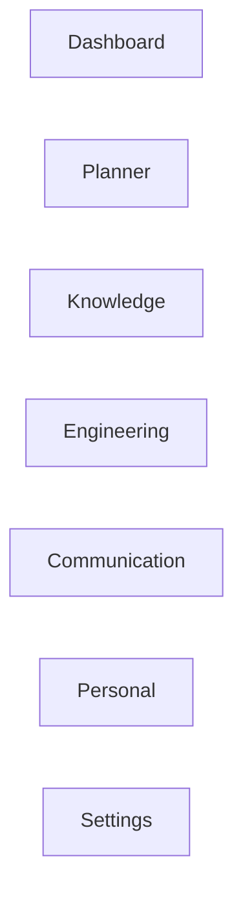
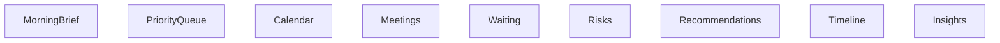
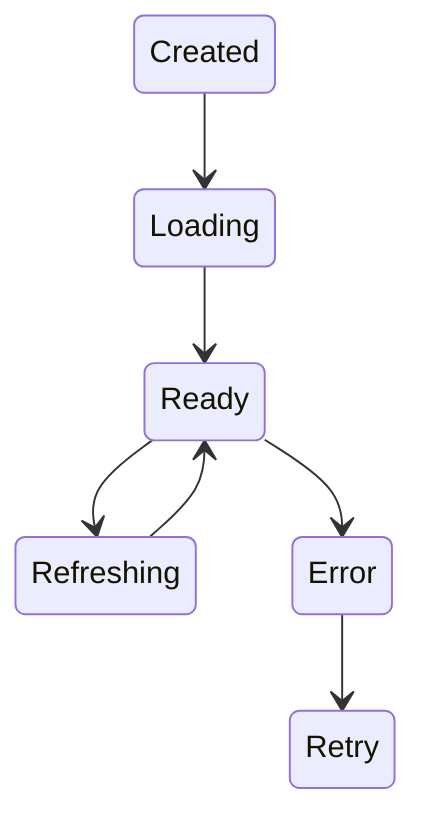

# RFC-004 — Chapter 7

# Frontend Architecture & Executive Experience

---

# Executive Summary

The frontend is **not** a UI layer.

It is the executive's operating environment.

Every interaction should reduce thinking.

Every screen should increase situational awareness.

The frontend is responsible for transforming the output of the Human Attention Engine into an interface that feels calm, intelligent and predictable.

This chapter defines:

- UI Architecture
- Navigation
- Dashboard Composition
- Workspace Model
- State Management
- Offline Experience
- Design System
- Accessibility
- Widget Framework
- Command Palette

---

# Design Philosophy

The frontend exists to answer one question.

> **"What should I know and what should I do next?"**

Not

> "Where should I click?"

The UI should disappear behind the workflow.

---

# Design Goals

## UX-001

Reduce navigation.

---

## UX-002

Reduce context switching.

---

## UX-003

Reduce decision fatigue.

---

## UX-004

Make information discoverable.

---

## UX-005

Surface context automatically.

---

## UX-006

Support uninterrupted work.

---

# Executive Workspace

ECC is not page-oriented.

ECC is workspace-oriented.

Traditional applications

```
Home

↓

Page

↓

Page

↓

Page
```

ECC

```
Workspace

↓

Context

↓

Action
```

The user should feel like they remain inside one operating environment.

---

# Primary Workspaces



Each workspace represents a domain.

Not a feature.

---

# Dashboard

The Dashboard is the default workspace.

Everything begins here.

Sections

- Morning Brief
- Priorities
- Calendar
- Waiting On
- Waiting For
- Risks
- Recommendations
- Executive Timeline
- Focus Block
- Quick Actions

---

# Dashboard Composition



Widgets never query services directly.

They consume View Models generated by backend APIs.

---

# Widget Framework

Every dashboard component is a Widget.

Widgets are independent modules.

Interface

```typescript
interface Widget {

 id

 title

 priority

 permissions

 refresh()

 render()

 actions()

}
```

Widgets should be independently deployable and testable.

---

# Widget Lifecycle



---

# Widget Priority

Widgets receive priority from the Human Attention Engine.

The frontend never determines importance.

The backend owns ordering.

---

# Command Palette

Every capability should be reachable through a global command interface.

Shortcut

```
⌘ + K
```

Examples

```
Open Atlas

Search Rahul

Schedule Focus Time

Prepare Meeting

Reply to Email

Show Risks

Open Decision

Create Note
```

Command execution should be faster than mouse navigation.

---

# Global Search

Search spans every domain.

Sources

- Knowledge Graph
- Documents
- Meetings
- Calendar
- Tasks
- People
- Decisions
- Engineering
- Notes

Results grouped by entity type.

Not source.

---

# Search Experience

```mermaid
flowchart LR

Input

↓

Intent

↓

Knowledge Search

↓

Ranking

↓

Context Preview

↓

Open Entity
```

Search should answer

"What?"

not

"Where?"

---

# Entity Pages

Every entity shares identical layout.

```
Header

↓

Summary

↓

Timeline

↓

Relationships

↓

Activity

↓

Documents

↓

Recommendations
```

People.

Projects.

Meetings.

Tasks.

Decisions.

All behave consistently.

---

# Timeline

Every entity has a timeline.

Example

Project Atlas

```
Created

↓

Architecture Review

↓

Decision

↓

Implementation

↓

Release
```

Executives reason chronologically.

The UI should too.

---

# Context Panel

Every screen has a collapsible Context Panel.

Contents

Related People

Open Tasks

Recent Decisions

Upcoming Meetings

Related Documents

Risks

AI Summary

The user should never manually gather context.

---

# Navigation

Navigation is persistent.

```
Dashboard

Planner

Knowledge

Engineering

Communication

Personal
```

Secondary navigation is contextual.

---

# State Management

Frontend state is divided into four categories.

## UI State

Local component state.

Examples

Dialogs.

Selections.

Panels.

---

## Session State

Authentication.

Preferences.

Current Workspace.

---

## Cached Domain State

Recently loaded entities.

Dashboard.

Calendar.

Knowledge.

---

## Live State

Streaming updates.

Notifications.

Meeting changes.

Recommendation refreshes.

---

# State Ownership

```mermaid
flowchart TB

Backend

↓

API

↓

Cache

↓

ViewModel

↓

Component
```

Components never own business state.

---

# Offline Experience

Offline mode is a first-class feature.

Available

- Search
- Knowledge
- Notes
- Dashboard
- Planner
- Calendar
- Recent Documents

Unavailable

- Synchronization
- External APIs
- Live recommendations

Synchronization resumes automatically.

---

# Desktop First

Primary platform

Desktop.

Large displays.

Multiple monitors.

Future

Tablet.

Mobile.

The desktop experience is optimized before responsive layouts.

---

# Multi-Window Support

Executives often work across multiple monitors.

Supported

Dashboard

↓

Meeting Preparation

↓

Engineering

↓

Knowledge

Each window maintains synchronized context.

---

# Notification Center

Notifications are not chat messages.

They represent attention.

Categories

Immediate

Today

Scheduled

Informational

Dismissed

Notification history remains searchable.

---

# Design System

Core Principles

Consistency.

Spacing.

Typography.

Accessibility.

Predictability.

The design system owns

- Colors
- Icons
- Layout
- Components
- Motion
- Spacing
- Typography

No feature invents UI independently.

---

# Accessibility

Minimum requirements

WCAG AA

Keyboard navigation

Screen reader support

Focus indicators

Reduced motion

High contrast

Large text

Accessibility is not optional.

---

# Performance Targets

Initial Load

<2 seconds

---

Dashboard Refresh

<500 ms

---

Search

<300 ms

---

Navigation

<100 ms

---

Command Palette

<100 ms

---

Entity Page

<500 ms

---

# Frontend Architecture

```mermaid
flowchart TB

React

↓

Application Shell

↓

Workspace

↓

Widgets

↓

Shared Components

↓

Design System
```

Business logic never exists in React components.

---

# Component Hierarchy

```
App

↓

Workspace

↓

Page

↓

Section

↓

Widget

↓

Component

↓

Primitive
```

Lower layers never know higher layers.

---

# View Models

Backend returns View Models.

Not database entities.

Example

```
MeetingView

PriorityView

DashboardView

ProjectView

RiskView
```

Frontend remains presentation-focused.

---

# Error Experience

Errors should be actionable.

Bad

```
500

Internal Server Error
```

Good

```
GitHub synchronization is temporarily unavailable.

Engineering insights may be delayed.

Last successful sync:
12 minutes ago.
```

---

# Progressive Loading

Priority order

Application Shell

↓

Morning Brief

↓

Priority Queue

↓

Calendar

↓

Recommendations

↓

Everything Else

Users should never wait for the entire dashboard.

---

# Personalization

Users may customize

Widget visibility

Workspace layout

Keyboard shortcuts

Theme

Working hours

Focus preferences

Business workflows remain consistent.

---

# Security

Frontend never stores

Passwords

OAuth tokens

Secrets

API keys

Authentication handled by Platform Services.

---

# Architecture Constraints

## ARC-UX-001

The frontend SHALL remain presentation-only.

---

## ARC-UX-002

Business logic SHALL exist in backend domains.

---

## ARC-UX-003

Widgets SHALL be independently testable.

---

## ARC-UX-004

Search SHALL span all domains.

---

## ARC-UX-005

The Command Palette SHALL access every major capability.

---

## ARC-UX-006

Dashboard ordering SHALL originate from the Human Attention Engine.

---

# Architecture Fitness Functions

AFF-UX-001

Keyboard-first workflows supported.

---

AFF-UX-002

Navigation depth ≤3.

---

AFF-UX-003

Dashboard usable within 30 seconds.

---

AFF-UX-004

Entity pages follow a consistent layout.

---

AFF-UX-005

Offline mode remains functional.

---

AFF-UX-006

No React component exceeds 300 lines without justification.

---

AFF-UX-007

Every reusable UI component belongs to the Design System.

---

# Summary

The Frontend Architecture transforms Executive Command Center from a collection of services into a cohesive executive operating environment.

The frontend is designed around:

- Workspaces instead of pages
- Context instead of navigation
- Widgets instead of monoliths
- Keyboard-first interaction
- Calm interfaces
- Progressive loading
- Offline-first operation
- Consistent entity experiences

Every interaction should reinforce the product's central promise:

> **Help executives spend less time operating software and more time making decisions.**

---

# Next Chapter

**RFC-004 Chapter 8 — Data Platform & Storage Architecture**

Topics

- PostgreSQL
- Neo4j
- Qdrant
- Redis
- Object Storage
- Event Store
- Data Ownership
- CQRS Read Models
- Backup & Recovery
- Data Lifecycle
- Archival Strategy
- Storage Abstraction Layer
