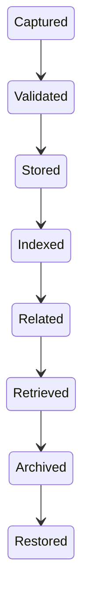

# RFC-004 — Chapter 8

# Data Platform & Storage Architecture

---

# Executive Summary

The Data Platform is responsible for one thing:

> Persist information in the storage engine most appropriate for its access pattern.

ECC intentionally avoids forcing every workload into a single database.

Instead, it uses a **polyglot persistence architecture** behind a single abstraction layer called the **Personal Knowledge Operating System (PKOS).**

Business domains never communicate directly with Neo4j, PostgreSQL, Qdrant or Redis.

Instead they communicate with PKOS.

This allows storage technologies to evolve independently of application logic.

---

# Design Philosophy

The storage architecture optimizes for

- correctness
- explainability
- replaceability
- retrieval quality
- long-term evolution

rather than minimizing the number of databases.

---

# Architectural Goals

## DP-001

No business domain knows storage implementation.

---

## DP-002

Every piece of information has exactly one authoritative owner.

---

## DP-003

Every storage engine has one responsibility.

---

## DP-004

Storage technologies remain replaceable.

---

## DP-005

Knowledge can always be reconstructed from raw events.

---

# Storage Architecture

```mermaid
flowchart TD

BusinessDomains

↓

PKOS

↓

Query Layer

↓

Storage Providers

↓

PostgreSQL

Neo4j

Qdrant

Redis

Object Storage

Event Store
```

PKOS is the only storage abstraction visible to business domains.

---

# Personal Knowledge Operating System (PKOS)

PKOS is not a database.

It is the unified data platform of ECC.

Responsibilities

- Entity Management
- Relationship Management
- Timeline
- Memory
- Search
- Retrieval
- Identity Resolution
- Versioning
- Provenance
- Evidence

PKOS exposes logical APIs.

It hides physical storage.

---

# Storage Responsibilities

| Storage | Responsibility |
|----------|----------------|
| PostgreSQL | Transactions |
| Neo4j | Relationships |
| Qdrant | Semantic similarity |
| Redis | Cache |
| Object Storage | Files |
| Event Store | Immutable history |

No storage overlaps ownership.

---

# PostgreSQL

Purpose

Transactional persistence.

Stores

- Users
- Tasks
- Configuration
- Sessions
- Calendars
- Preferences
- Scheduling

Characteristics

ACID

Relational

Indexed

Consistent

---

# Neo4j

Purpose

Relationship reasoning.

Stores

People

Projects

Meetings

Organizations

Documents

Decisions

Dependencies

Examples

```
Lucky

↓

Owns

↓

Project Atlas

↓

Contains

↓

Decision

↓

Referenced By

↓

Meeting
```

Traversal is first-class.

---

# Qdrant

Purpose

Semantic similarity.

Stores

Embeddings for

- documents
- emails
- meetings
- notes
- tasks
- conversations

Never stores source documents.

Only vectors and metadata.

---

# Redis

Purpose

Transient state.

Stores

- Sessions
- Queues
- Rate Limits
- Temporary Context
- Prompt Cache
- Widget Cache

Redis is disposable.

---

# Object Storage

Purpose

Binary assets.

Examples

PDF

Images

Word

PowerPoint

Audio

Video

OCR results reference objects.

Not duplicates.

---

# Event Store

Purpose

Immutable history.

Every observation becomes an event.

Example

```
EmailReceived

↓

CommitmentDetected

↓

TaskCreated

↓

Completed
```

Nothing is deleted.

Events are append-only.

---

# Event Sourcing

Business domains never reconstruct state manually.

Instead

```mermaid
flowchart LR

Events

↓

Projection

↓

Read Model

↓

Dashboard
```

Current state is a projection.

History is immutable.

---

# CQRS

ECC adopts CQRS.

Commands

↓

Events

↓

Read Models

↓

Queries

Command Model

Optimized for correctness.

Query Model

Optimized for speed.

---

# Read Models

Examples

Dashboard View

Meeting View

Project View

Risk View

Timeline View

Relationship View

Read Models are disposable.

They can be rebuilt.

---

# Write Models

Write models maintain

Business Rules

Validation

Consistency

Audit

Writes are authoritative.

Reads are optimized.

---

# Data Ownership

Every entity has one owner.

| Entity | Owner |
|----------|-------|
| Task | Planning |
| Meeting | Communication |
| Person | Knowledge |
| Project | Knowledge |
| Decision | Knowledge |
| Calendar | Planning |
| Risk | Attention |
| Recommendation | AI Runtime |

Ownership never overlaps.

---

# Data Lifecycle



Deletion requires explicit user action.

---

# Identity Resolution

PKOS owns identity.

Sources

Email

Slack

GitHub

Calendar

Directory

Manual Input

Multiple identities merge into one logical entity.

---

# Versioning

Every mutation creates a new version.

```
Meeting

v1

↓

v2

↓

v3
```

History remains queryable.

No destructive updates.

---

# Provenance

Every stored fact records

Source

Timestamp

Connector

Confidence

Evidence

Version

No anonymous knowledge exists.

---

# Retrieval Engine

PKOS combines four retrieval methods.

```mermaid
flowchart TB

Keyword

Semantic

Graph

Temporal

↓

Ranking Engine

↓

Context Package
```

Results are merged before reaching the AI Runtime.

---

# Context Package

Instead of returning documents,

PKOS returns context.

Example

```yaml
people:

projects:

meetings:

tasks:

decisions:

risks:

documents:

timeline:

confidence:
```

The AI Runtime consumes Context Packages.

Not databases.

---

# Storage Abstraction

Every storage provider implements

```typescript
StorageProvider

save()

find()

search()

delete()

version()

health()

backup()
```

Changing Neo4j requires changing only its provider.

Not business code.

---

# Backup Strategy

Every storage engine follows

```
Snapshot

↓

Incremental

↓

Verification

↓

Encryption

↓

Retention
```

Backups are tested regularly.

---

# Recovery

Recovery priority

1. PostgreSQL

2. Event Store

3. Neo4j

4. Qdrant

5. Redis

Read models are rebuilt automatically.

---

# Data Retention

Nothing is automatically deleted.

Lifecycle

Active

↓

Historical

↓

Archived

↓

User Deleted

Deletion always requires confirmation.

---

# Encryption

Encrypted at Rest

- PostgreSQL
- Neo4j
- Object Storage

Encrypted in Transit

- Internal APIs
- Connector APIs

Sensitive fields additionally encrypted.

Examples

OAuth Tokens

API Keys

Secrets

---

# Performance Targets

Transaction

<100 ms

---

Graph Traversal

<250 ms

---

Vector Search

<200 ms

---

Hybrid Retrieval

<500 ms

---

Dashboard Projection

<500 ms

---

Backup

Background only

---

# Scalability

Target

100M+ entities

500M+ relationships

1B+ events

10TB documents

Architecture should scale by replacing infrastructure.

Not changing business domains.

---

# Failure Modes

Neo4j Failure

↓

Relationship reasoning degraded

↓

Everything else functional

---

Qdrant Failure

↓

Semantic search unavailable

↓

Keyword + Graph remain

---

Redis Failure

↓

Performance degraded

↓

Correctness maintained

---

Event Store Failure

↓

Writes paused

↓

Reads continue

No silent data loss.

---

# Architecture Constraints

## ARC-DATA-001

Business domains SHALL use PKOS.

---

## ARC-DATA-002

Storage engines SHALL remain replaceable.

---

## ARC-DATA-003

Events SHALL be immutable.

---

## ARC-DATA-004

Read models SHALL be rebuildable.

---

## ARC-DATA-005

Every fact SHALL include provenance.

---

## ARC-DATA-006

Entity identity SHALL be globally unique.

---

## ARC-DATA-007

Storage providers SHALL expose health.

---

# Architecture Fitness Functions

AFF-DATA-001

No business domain imports database clients.

---

AFF-DATA-002

Every query executes through PKOS.

---

AFF-DATA-003

Read models rebuild successfully from Event Store.

---

AFF-DATA-004

Every entity has provenance.

---

AFF-DATA-005

Hybrid retrieval latency <500 ms.

---

AFF-DATA-006

Graph integrity continuously validated.

---

AFF-DATA-007

Backups restore successfully during quarterly disaster recovery tests.

---

# Technology Mapping

| Capability | Initial Technology | Replaceable |
|-------------|--------------------|-------------|
| Transactions | PostgreSQL | ✅ |
| Graph | Neo4j | ✅ |
| Vector Search | Qdrant | ✅ |
| Cache | Redis | ✅ |
| Object Storage | Local Files / S3-compatible | ✅ |
| Event Store | PostgreSQL (append-only) → Dedicated Event Store (future) | ✅ |

---

# Summary

The Data Platform is the persistence foundation of Executive Command Center.

Its defining architectural decision is the introduction of the **Personal Knowledge Operating System (PKOS)** as the sole storage abstraction.

Business domains never interact with storage technologies directly.

Instead they operate against logical concepts:

- Knowledge
- Memory
- Timeline
- Relationships
- Search
- Provenance

This ensures:

- storage independence
- explainable AI
- hybrid retrieval
- event reconstruction
- long-term maintainability
- scalable executive memory

The combination of PKOS, CQRS, Event Sourcing and Polyglot Persistence creates a platform capable of supporting years of accumulated executive knowledge while remaining adaptable as storage technologies evolve.

---

# Next Chapter

**RFC-004 Chapter 9 — Security, Privacy & Local-First Architecture**

Topics

- Zero Trust
- Threat Model
- Local-First Synchronization
- Secret Management
- Encryption
- Prompt Injection Defense
- Tool Permissions
- AI Safety
- Audit Trail
- Privacy Model
- Disaster Recovery
- Compliance
